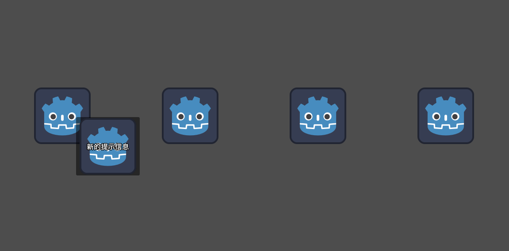

### 目录说明

#### 基础使用
- [ToolTip](./comps/base/ToolTip/)

- [RichTextLabel](./comps/base/RichTextLabel/) 富文本展示 BBcode
- [Callable](./comps/base/Callable/) 方法调用
- [Thread](./comps/base/Thread/) 多线程

#### Touch
- [MultiTouchView](./comps/Touch/MultiTouchView) 多点触摸
- [TouchViewDirection](./comps/Touch/TouchViewDirection)  滑动视图判断滑动方向

#### 进阶demo
- [JokerCards](./comps/demo/JokerCards/) 小丑牌效果

#### UX
- [CircularMotion](./comps/UI/CircularMotion/) 圆周运动
- [GlowLine](./comps/UI/GlowLine) 发光运动线条

#### Shader
- [FlipBook](./comps/Shader/FlipBook) 序列帧shader动画